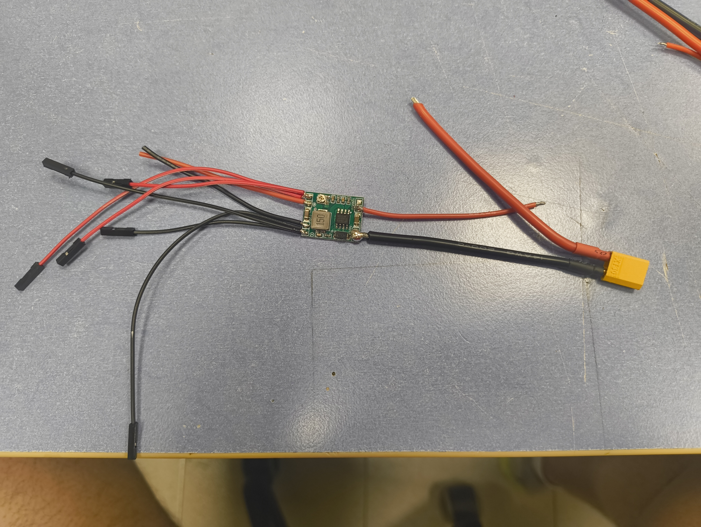
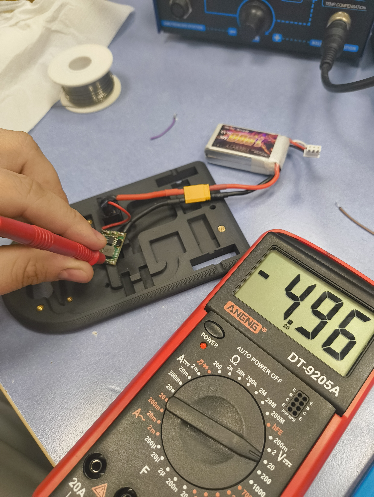
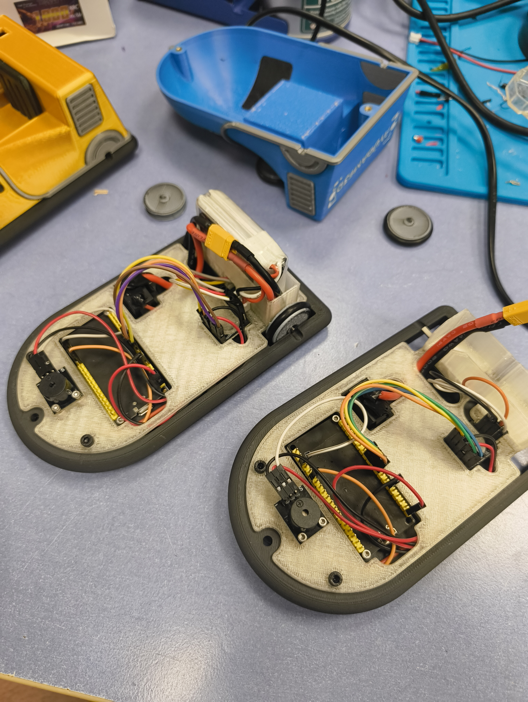
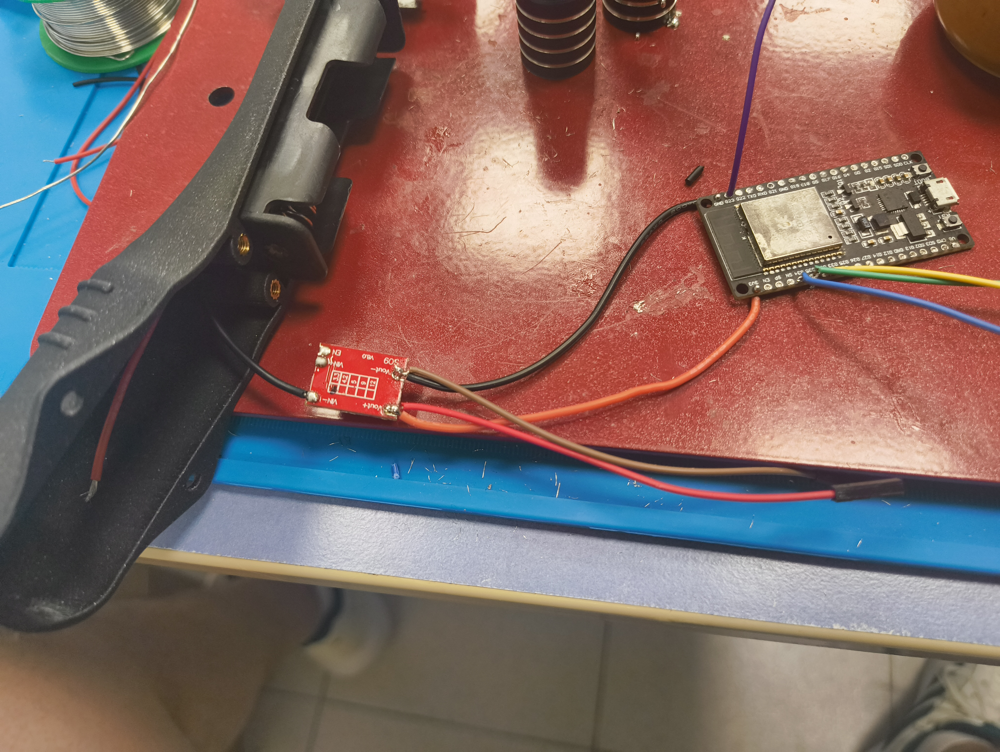
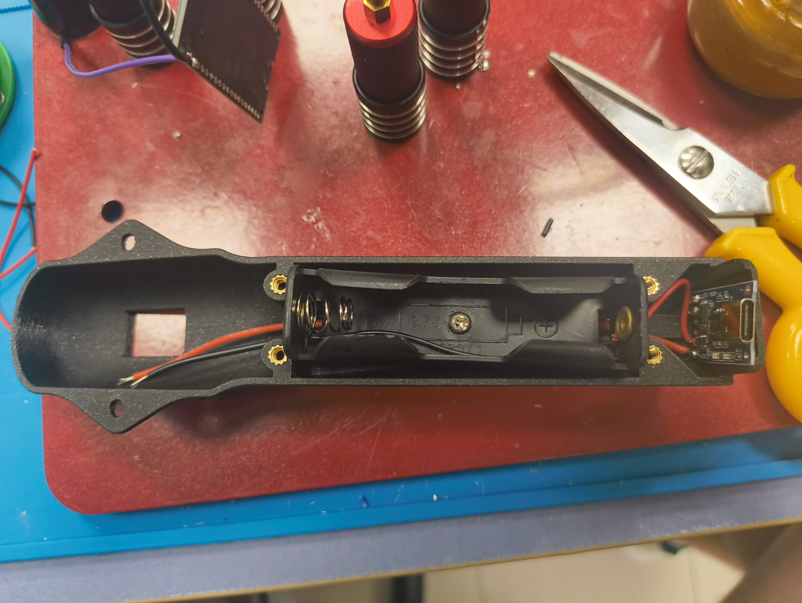
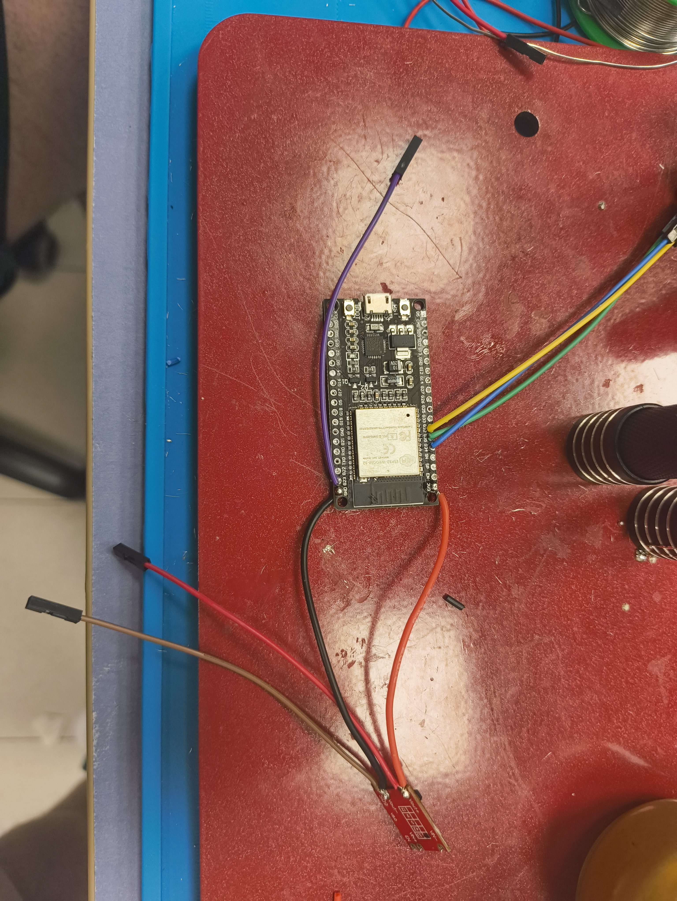
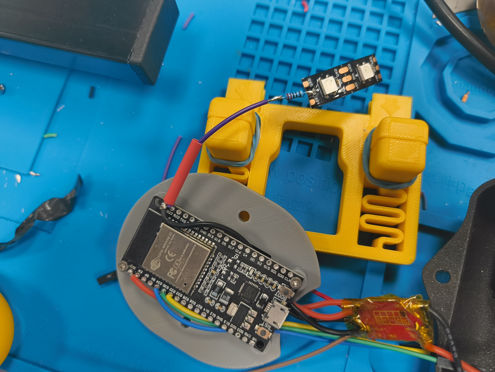
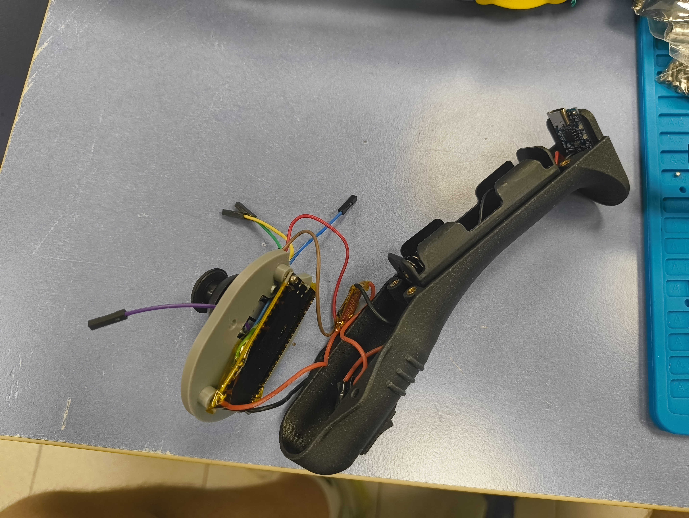

# Ayudame3D– Helpi Bumper Cars

Proyecto de coches de choque para los Helpis de Ayudame3D.

---

# Montaje del coche

Se recomienda montar primero todo el circuito de alimentación:

- Portapilas / batería
- Interruptor
- Regulador de voltaje
- LED de encendido

Antes de continuar con el resto del montaje, es importante ajustar el regulador de voltaje a aproximadamente 5V de salida.

Una vez comprobada la alimentación, el resto de componentes pueden conectarse mediante pines, lo que permite trabajar cómodamente incluso con la tapa de la electrónica ya colocada.

## Fotos del montaje del coche

## Importante

Puede costar un poco cerrar el coche completamente.

Para que todo encaje correctamente, conviene colocar el conector de la batería lo más pegado posible a la propia batería, aprovechando bien el espacio interior.

---

# Montaje del mando

Para facilitar el montaje, se recomienda soldar todo el circuito de alimentación con el interruptor ya colocado en su posición definitiva dentro de la carcasa.

También es recomendable retirar los pines de la ESP32 para ganar algo más de espacio interior y conseguir que todos los componentes encajen mejor dentro del mando.

## Fotos del montaje del mando

---

# Notas

- Revisar polaridades antes de alimentar el circuito.
- Comprobar el voltaje de salida del regulador antes de conectar la electrónica principal.
- Evitar forzar el cierre de las carcasas para no dañar cables o conectores.
